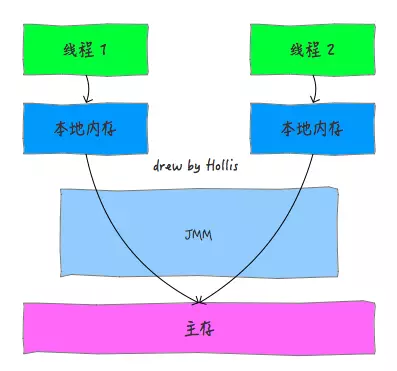

## 什么是Java内存模型

**Java内存模型定义了Java虚拟机与计算机内存的工作方式**。Java虚拟机是计算机的模型，这个计算机模型自然包括了内存模型，即Java内存模型。

**Java内存模型描述了Java线程与内存的交互方式**，它屏蔽了各种硬件和操作系统的访问差异，保证了Java程序在各平台下对内存的访问都能保持效果一致。**解决由于多线程通过共享内存进行通信时，存在的本地内存数据不一致、编译器会对代码指令重排序、处理器会对代码乱序执行等带来的问题**。目的是保证并发编程场景中的**原子性**、**可见性**和**有序性**。

Java内存模型规定了 **所有的变量都存储在主内存中，每条线程还有自己的工作内存**，线程的工作内存中保存了该线程中用到的变量的主内存副本拷贝，**线程对变量的所有操作都必须在工作内存中进行，而不能直接读写主内存**。不同的线程之间也无法直接访问对方工作内存中的变量，线程间变量的传递均需要自己的工作内存和主存之间进行数据同步进行。



Java内存模型定义了Java线程与内存的交互方式，在Java语言层面，提供了volatile、synchronized、final等关键字来描述程序多线程行为，而Java内存模型则定义了这些关键字的行为。

## 支撑Java内存模型的基本原理

### 指令重排序

在执行程序时，为了提高性能，编译器和处理器会对指令做重排序。但是，JMM确保在不同的编译器和不同的处理器平台之上，通过插入特定类型的`Memory Barrier`来禁止特定类型的编译器重排序和处理器重排序，为上层提供一致的内存可见性保证。

### Happens-Before原则

先抛一个问题：当一个多线程共享变量被某个线程修改后，如何让这个修改被需要读取这个变量的线程感知到。

JMM定义了Happens-Before原则。只要我们理解了Happens-Before原则，无需了解JVM底层的内存操作，就可以利用Happens-Before原则来解决并发编程中的变量可见性问题，也可以理解什么时候变量对其他线程是可见的。

JMM定义的Happens-Before原则是一组偏序关系：**对于两个操作A和B，这两个操作可以在不同的线程中执行。如果A Happens-Before B，那么可以保证，当A操作执行完后，A操作的执行结果对B操作是可见的。**

Happens-Before的规则包括：

1. 程序顺序规则
2. 锁定规则
3. volatile变量规则
4. 线程启动规则
5. 线程结束规则
6. 中断规则
7. 终结器规则
8. 传递性规则

下面我们将详细讲述这8条规则的具体内容。

#### 程序顺序规则

在一个线程内部，按照程序代码的**书写**顺序，书写在前面的代码操作Happens-Before书写在后面的代码操作。这时因为*Java语言规范*要求JVM在单个线程内部要维护类似严格串行的语义，如果多个操作之间有先后依赖关系，则不允许对这些操作进行重排序。

#### 锁定规则

对锁M解锁之前的**所有**操作Happens-Before对锁M加锁之后的**所有**操作。

```
class HappensBeforeLock {
    private int value = 0;
    
    public synchronized void setValue(int value) {
        this.value = value;
    }
    
    public synchronized int getValue() {
        return value;
    }
}
```

上面这段代码，setValue和getValue两个方法共享同一个监视器锁。假设setValue方法在线程A中执行，getValue方法在线程B中执行。setValue方法会先对value变量赋值，然后释放锁。getValue方法会先获取到同一个锁后，再读取value的值。所以根据锁定原则，线程A中对value变量的修改，可以被线程B感知到。
如果这个两个方法上没有synchronized声明，则在线程A中执行setValue方法对value赋值后，线程B中getValue方法返回的value值并不能保证是最新值。
本条锁定规则对显示锁(ReentrantLock)和内置锁(synchronized)在加锁和解锁等操作上有着相同的内存语义。
对于锁定原则，可以像下面这样去理解：同一时刻只能有一个线程执行锁中的操作，所以锁中的操作被重排序外界是**不关心**的，只要最终结果能被外界感知到就好。除了重排序，剩下影响变量可见性的就是CPU缓存了。在锁被释放时，A线程会把释放锁之前所有的操作结果同步到主内存中，而在获取锁时，B线程会使自己CPU的缓存失效，重新从主内存中读取变量的值。这样，A线程中的操作结果就会被B线程感知到了。

#### volatile变量规则

对一个volatile变量的写操作及这个写操作之前的所有操作Happens-Before对这个变量的读操作及这个读操作之后的所有操作。

```
Map configOptions;
char[] configText; //线程间共享变量，用于保存配置信息
// 此变量必须定义为volatile
volatile boolean initialized = false;

// 假设以下代码在线程A中执行
// 模拟读取配置信息，当读取完成后将initialized设置为true以通知其他线程配置可用configOptions = new HashMap();
configText = readConfigFile(fileName);
processConfigOptions(configText, configOptions);
initialized = true;

// 假设以下代码在线程B中执行
// 等待initialized为true，代表线程A已经把配置信息初始化完成
while (!initialized) {    
    sleep();
}
//使用线程A中初始化好的配置信息
doSomethingWithConfig();
```

上面这段代码，读取配置文件的操作和使用配置信息的操作分别在两个不同的线程A、B中执行，两个线程通过共享变量configOptions传递配置信息，并通过共享变量initialized作为初始化是否完成的通知。initialized变量被声明为volatile类型的，根据volatile变量规则，volatile变量的写入操作Happens-Before对这个变量的读操作，所以在线程A中将变量initialized设为true，线程B中是可以感知到这个修改操作的。
但是更牛逼的是，volatile变量不仅可以保证自己的变量可见性，还能保证**书写**在volatile变量写操作之前的操作对其它线程的可见性。考虑这样一种情况，如果volatile变量仅能保证自己的变量可见性，那么当线程B感知到initialized已经变成true然后执行doSomethingWithConfig操作时，可能无法获取到configOptions最新值而导致操作结果错误。所以volatile变量不仅可以保证自己的变量可见性，还能保证书写在volatile变量写操作之前的操作Happens-Before书写在volatile变量读操作之后的那些操作。
可以这样理解volatile变量的写入和读取操作流程：
首先，volatile变量的操作会禁止与其它普通变量的操作进行重排序，例如上面代码中会禁止initialized = true与它上面的两行代码进行重排序(但是它上面的代码之间是可以重排序的)，否则会导致程序结果错误。volatile变量的写操作就像是一条基准线，到达这条线之后，不管之前的代码有没有重排序，反正到达这条线之后，前面的操作都已完成并生成好结果。
然后，在volatile变量写操作发生后，A线程会把volatile变量本身和书写在它之前的那些操作的执行结果一起同步到主内存中。
最后，当B线程读取volatile变量时，B线程会使自己的CPU缓存失效，重新从主内存读取所需变量的值，这样无论是volatile本身，还是书写在volatile变量写操作之前的那些操作结果，都能让B线程感知到，也就是上面程序中的initialized和configOptions变量的最新值都可以让线程B感知到。
原子变量与volatile变量在读操作和写操作上有着相同的语义。

#### 线程启动规则

Thread对象的start方法及**书写**在start方法前面的代码操作Happens-Before此线程的每一个动作。
start方法和新线程中的动作一定是在两个不同的线程中执行。*线程启动规则*可以这样去理解：调用start方法时，会将start方法之前所有操作的结果同步到主内存中，新线程创建好后，需要从主内存获取数据。这样在start方法调用之前的所有操作结果对于新创建的线程都是可见的。

#### 线程终止规则

线程中的任何操作都Happens-Before其它线程检测到该线程已经结束。这个说法有些抽象，下面举例子对其进行说明。
假设两个线程s、t。在线程s中调用t.join()方法。则线程s会被挂起，等待t线程运行结束才能恢复执行。当t.join()成功返回时，s线程就知道t线程已经结束了。所以根据本条原则，在t线程中对共享变量的修改，对s线程都是可见的。类似的还有Thread.isAlive方法也可以检测到一个线程是否结束。
可以猜测，当一个线程结束时，会把自己所有操作的结果都同步到主内存。而任何其它线程当发现这个线程已经执行结束了，就会从主内存中重新刷新最新的变量值。所以结束的线程A对共享变量的修改，对于其它检测了A线程是否结束的线程是可见的。

#### 中断规则

一个线程在另一个线程上调用interrupt,Happens-Before被中断线程检测到interrupt被调用。
假设两个线程A和B，A先做了一些操作operationA，然后调用B线程的interrupt方法。当B线程感知到自己的中断标识被设置时(通过抛出InterruptedException，或调用interrupted和isInterrupted),operationA中的操作结果对B都是可见的。

#### 终结器规则

一个对象的构造函数执行结束Happens-Before它的finalize()方法的开始。
“结束”和“开始”表明在时间上，一个对象的构造函数必须在它的finalize()方法调用时执行完。
根据这条原则，可以确保在对象的finalize方法执行时，该对象的所有field字段值都是可见的。

#### 传递性规则

如果操作A Happens-Before B，B Happens-Before C，那么可以得出操作A Happens-Before C。

