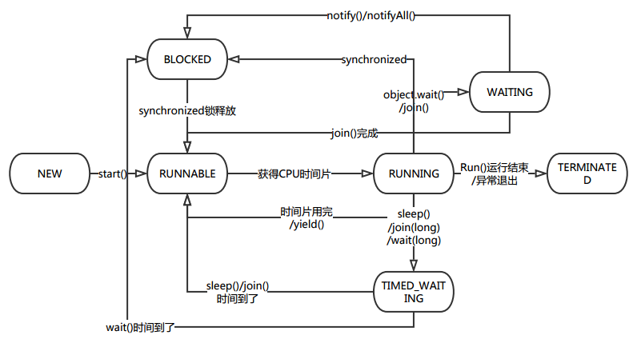

### 线程的状态转换关系

1）**BLOCKED**：线程等待监视器锁，就是线程在等待获取锁进入同步块或者同步方法中。两个死锁的线程即是Blocked。

2）**WAITING**：

三种方法可以使线程进入WAITING:

- [Object.wait](https://docs.oracle.com/javase/8/docs/api/java/lang/Object.html#wait--) with no timeout
- [Thread.join](https://docs.oracle.com/javase/8/docs/api/java/lang/Thread.html#join--) with no timeout
- [LockSupport.park](https://docs.oracle.com/javase/8/docs/api/java/util/concurrent/locks/LockSupport.html#park--)

比BLOCKED状态进步一些，指我已经获得锁了，但由于有些条件不满足，我自己等会，调用object.wait()方法。等条件满足了，别的线程调用notify再叫我。另外也可以调用Thread.join()方法，顾名思义就是调用别的线程的join方法，让别人join进来先执行，那我就只能等会了。但是由于wait()和notify()以及notifyAll()用于协调对共享资源的存取，所以必须在synchronized块中使用，即调用wait的时候需要获取锁，调用后锁释放。所以即便wait状态的线程被notfiy唤醒了，也需要再次获得锁，所以唤醒后进入Blocked状态。

3）**TIMED_WAITING**：

如下方法使线程进入该状态

- [Thread.sleep](https://docs.oracle.com/javase/8/docs/api/java/lang/Thread.html#sleep-long-)
- [Object.wait](https://docs.oracle.com/javase/8/docs/api/java/lang/Object.html#wait-long-) with timeout
- [Thread.join](https://docs.oracle.com/javase/8/docs/api/java/lang/Thread.html#join-long-) with timeout
- [LockSupport.parkNanos](https://docs.oracle.com/javase/8/docs/api/java/util/concurrent/locks/LockSupport.html#parkNanos-java.lang.Object-long-)
- [LockSupport.parkUntil](https://docs.oracle.com/javase/8/docs/api/java/util/concurrent/locks/LockSupport.html#parkUntil-java.lang.Object-long-)

类比WAITING，差异是不需要notify()或者notifyAlL()方法唤醒，时间到了我自己醒了。另外sleep比较好理解，就是让当前线程睡一会，与wait的区别是它不释放锁。

4）**RUNNABLE**不用多说，在JAVA虚拟机中已经在运行，但是有可能在等待操作系统资源，比如CPU时间片。

- 处于Runnable的线程一定消耗cpu么

  > 不一定，比如线程处于io等待，实际上是线程是挂起，不消耗cpu的。
### Java线程堆栈解读

#### tid和nid

在采集Java线程堆栈时，有个nid和tid。tid表示Java层面的线程id，是Java给每个线程所分配的一个id，nid(Native thread ID)表示的本地线程id，与实际的操作系统线程id相一致。

#### 堆栈中与锁相关的三种状态

- 当一个线程占有一个锁的时候，线程堆栈中会打印—locked <0x22bffb60> 
- 当一个线程正在等待其它线程释放该锁，线程堆栈中会打印—**waiting to lock** <0x22bffb60> 
- 当一个线程占有一个锁，但又执行到该锁的wait()上，线程堆栈中首先打印locked,然后又 会打印—**waiting on** <0x22c03c60> 

